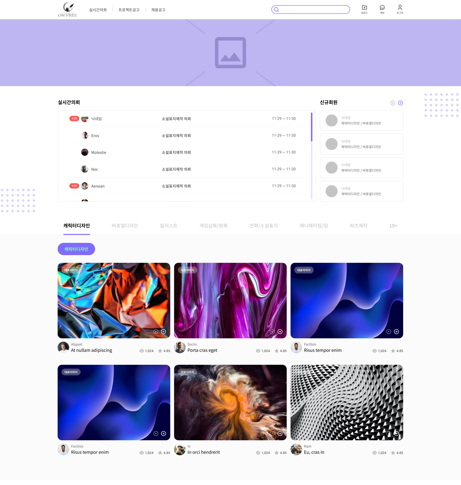
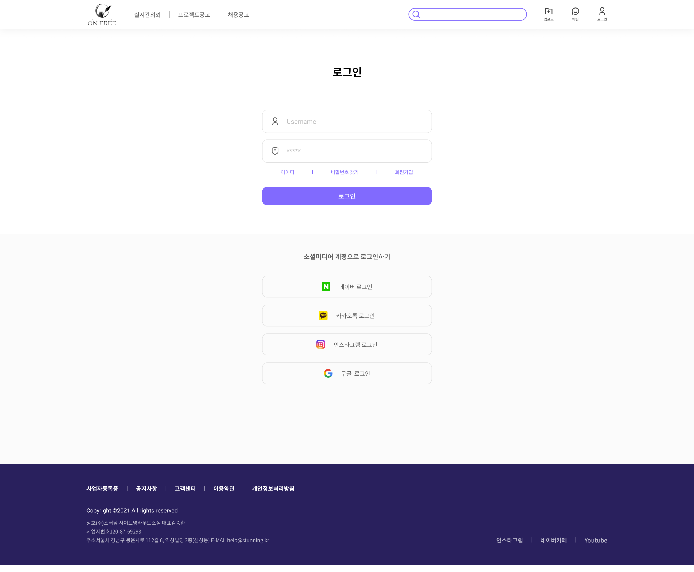
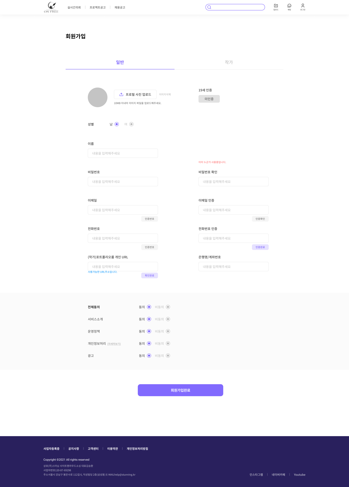

## 소개

해당 프로젝트는 **디자이너와 의뢰자를 이어주는 플랫폼**으로 스타트업을 준비하는 onfree에서 제안하여 개발에 참여하였으며 향후에  포트폴리오로 사용하는 것을 전제하에 프로젝트를 참여하였으며현재 투자가 미루어져 프로젝트는 개발은 종료된 상태이며 , 포트폴리오 용도로 추가적으로 개발 중입니다.

**※ 프로젝트가 잠정 중단된 관계로 관계자로 부터 모든 소스에 대한 공개를 허락받았습니다.**


[Onfree API Document](https://www.notion.so/Onfree-API-Document-985007ac18a64b9c811a96adf569eb01)

## 📘서비스 내용

그래픽픽, 캐릭터, 3D 일러스트, UI/UX 등 여러 디자인 분야 전문가에게 의뢰 외주 및 프로젝트, 채용 공고를 할 수 있는 웹 앱 플랫폼


### ☝️핵심 기능

1. 원하는 디자인 의뢰를 **[실시간 의뢰]**  게시글을 작성하여 해당 분야 여러 디자이너들이 해당 게시글에 지원하여 디자이너와 의뢰자를 이어주는 기능
2. 의뢰자가 의뢰하고자 하는 디자인 분야에 작가에게 직접 의뢰하여 이어주는 기능
3. 토스페이먼트를 사용 하여  안전하게 디자이너와 의뢰자의 거래
4. 디자이너들의 평판 및 솜씨를 확인 할 수 있는 포트폴리오룸
5. 소규모 의뢰가 아닌 프로젝트 단위에  제안 또는 채용 공고 기능 제공

## 🪛기술 스택

>- Spring
>  - spring boot, security, hateoas, Jpa
>- Swagger
>- DB 
>  - MariaDB, Redis, H2
>- AWS EC2, RDS, ElastiCache, S3
>- JWT
### 실행 방법
**※ 프로젝트 내부 중요 암호키들은 다 수정하였습니다(암호화x).**

```
> build
.\gradlew build

> 서버 start
docker-compose up
```

## 📖개발 내용

해당 프로젝트에서 모든 서버 개발과 DB 설계, 문서화 ,등 전반적인 백엔드 업무를 맡아 진행하였습니다.

1. **데이터 설계**
2. **모든 RestApi 개발**
    1. 로그인 구현 (회원가입, 로그인, 아이디 찾기, 패스워드 , 등)
        1. 작가 유저, 일반유저, 관리자 유저 분류
        2. JWT 토큰을 사용하여 인증 처리
        3. Redis를 활용하여 RefreshToken 관리 및 이메일 인증 관리
        4. ~~Oauth2 인증(네이버, 카카오, 인스타그램, 구글)~~
    2. 포트폴리오룸, 실시간 의뢰, 직접 의뢰
    3. 채팅 시스템 구현
        1. 웹소켓을 사용한 채팅 시스템 구현
        2. 채팅창에서 견적서, 결제 요청 알림, 환불 알림, 등 다양한 채팅 타입 구현
    4. PG 연동(토스페이먼트)
3. **문서화**
    1. Swagger를  사용하여 문서화 작업 진행
    2. Nothion으로 추가적으로 문서화 작업 진행
4. DevOps
    1. Docker, EC2, RDS, S3, ElastiCache, 연동

## 🔅향후 구현 계획

- 관리자 API
    - 각 설계된 데이터들을 조회 및 수정할 수 있는 관리자 API 구현
- Oauth2 로그인 기능 추가
    - 카카오, 구글, 인스타, 네이버
- Admin 권한에 세부 권한 분리
- 프로젝트 공고/채용 공고 구현

## 🎨서비스 디자인(피그마)
[이미지 더보기](https://puzzled-yellowhorn-acd.notion.site/onfree-c4a088c4829b4a7c937e767bfd8321f7)





